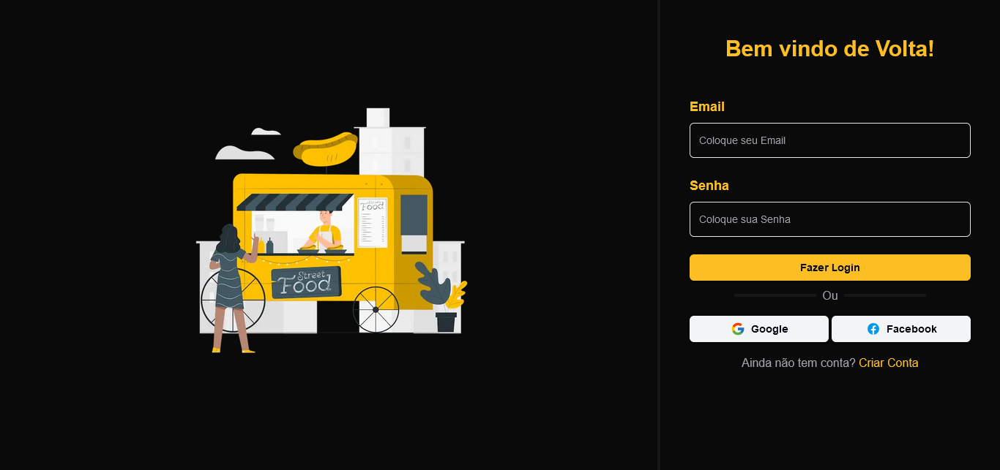
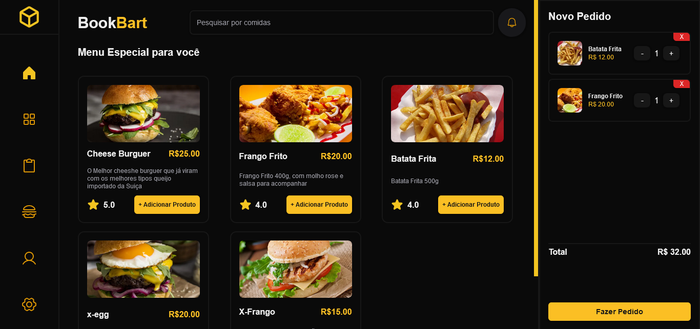
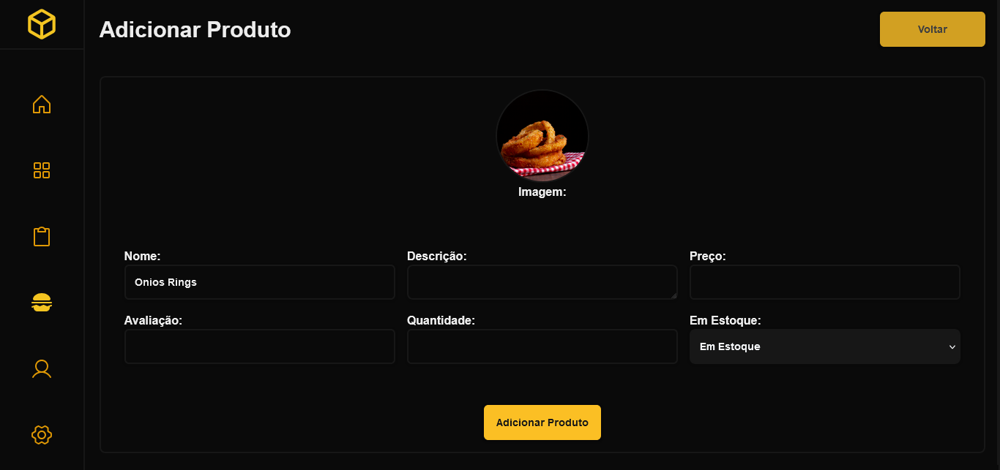
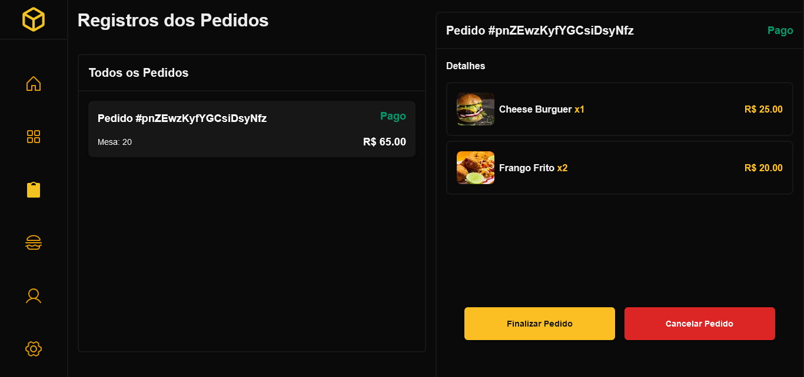

# Gerenciador de Produtos e Pedidos

Um aplicativo para gerenciar produtos e pedidos com autenticação de usuários. Feito com Next.js 14, TypeScript, Tailwind, Firebase e Shadcn UI.

## Funcionalidades
- Autenticação de usuários (Firebase)
- Adicionar, editar e deletar produtos
- Criar e gerenciar pedidos
- Responsivo para dispositivos móveis

### Tela de Login
<p aling="center">
   
</p>

### Dashboard - Listagem de Produtos
<p aling="center">
   
</p>

### Dashboard - Adicionar Produto
<p aling="center">
   
</p>

### Dashboard - Listagem dos Pedidos
<p aling="center">
   
</p>

## Tecnologias Utilizadas
- Next.js 14
- TypeScript
- Shadcn UI
- Tailwind CSS
- Firebase

## Como Rodar o Projeto

1. Clone o repositório:
   ```bash
   git clone https://github.com/GustavoNesi/Restaurant-Manager.git
